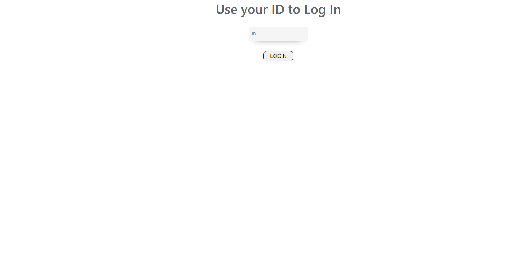
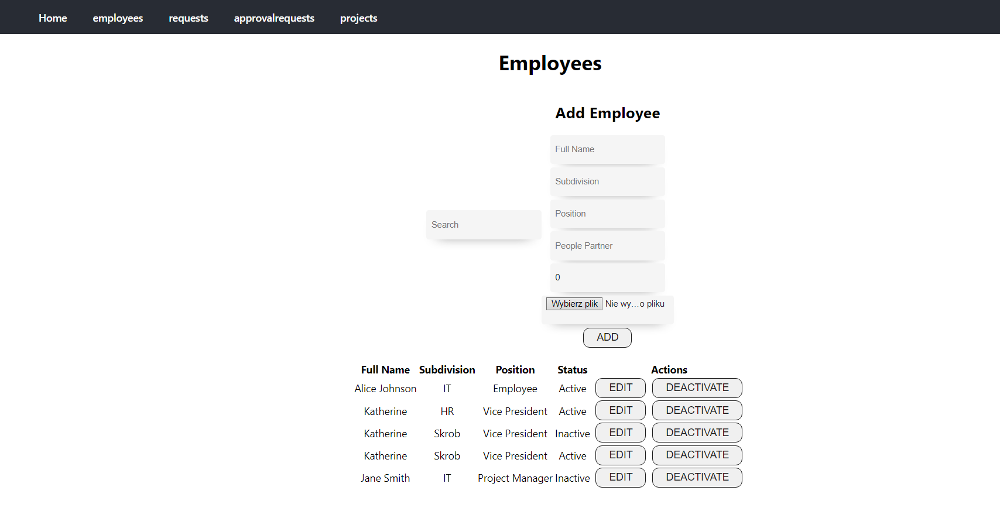
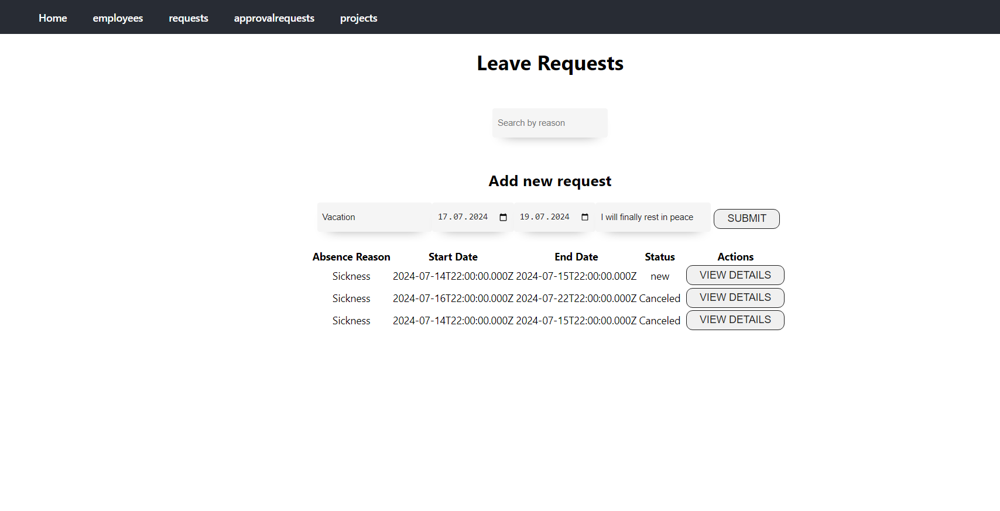
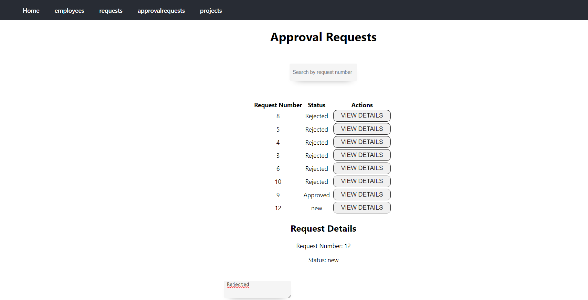
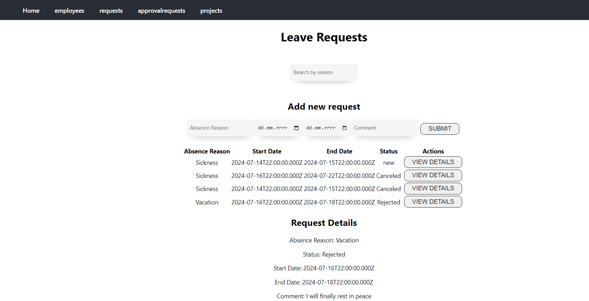
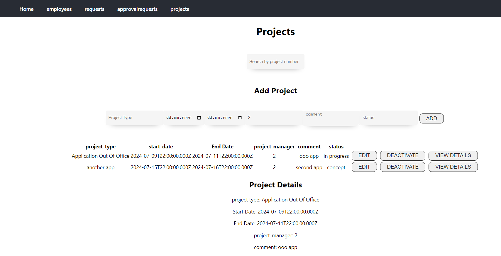

Creator Jakub Pawlik

The project was made using React with postgresql database

the backend of the app is placed in index.js file in backend folder

to run this program the user needs to have postgresql installed, or if you're using a different database some changes will probably be needed.

before running the app, it would be best to run npm init to make sure all packages are installed

the application out of office focuses on making it easier for the employees and managers to manage adding new employees, projects, and managing employee's leave requests.

Users can access their information in the employees tab, for normal employees ther's  just some personal data, however the HR and PMs can view all employees

in requests tab, users can add new leave requests, when that happens there is an approval request automatically generated and upon approving or rejecting, the leave request's status changes

in projects tab the project manager can add, edit and deactivate projects, other employees can view the details of the projects assigned to them.

Below are screenshots taken in the application

Login screen

Employees screen

Leave Requests screen - Adding new request

Approval requests screen - rejecting request

Leave Requests - showing rejected request

Projects screen

To create the tables used in the app, please use commands below

CREATE TABLE employees (
    id SERIAL PRIMARY KEY,
    full_name VARCHAR(255) NOT NULL,
    subdivision VARCHAR(255) NOT NULL,
    position VARCHAR(255) NOT NULL,
    status VARCHAR(50) NOT NULL,
    people_partner INT,
    out_of_office_balance INT NOT NULL,
    photo BYTEA,
    CONSTRAINT fk_people_partner FOREIGN KEY (people_partner) REFERENCES employees(id)
);

-- Create a partial unique index to ensure that only one employee can be an HR Manager
CREATE UNIQUE INDEX unique_hr_manager ON employees (id) WHERE position = 'HR Manager';

INSERT INTO employees (full_name, subdivision, position, status, out_of_office_balance)
VALUES ('John Doe', 'HR', 'HR Manager', 'Active', 10);

INSERT INTO employees (full_name, subdivision, position, status, out_of_office_balance, people_partner)
VALUES ('Jane Smith', 'IT', 'Project Manager', 'Active', 15, 1);

INSERT INTO employees (full_name, subdivision, position, status, out_of_office_balance, people_partner)
VALUES ('Alice Johnson', 'IT', 'Employee', 'Active', 20, 1);

CREATE TABLE leave_requests (
    id SERIAL PRIMARY KEY,
    employee INT NOT NULL REFERENCES employees(id),
    absence_reason VARCHAR(255) NOT NULL,
    start_date DATE NOT NULL,
    end_date DATE NOT NULL,
    comment TEXT,
    status VARCHAR(50) NOT NULL DEFAULT 'New'
);

CREATE TABLE approval_requests (
    id SERIAL PRIMARY KEY,
    approver INT NOT NULL REFERENCES employees(id),
    leave_request INT NOT NULL REFERENCES leave_requests(id),
    status VARCHAR(50) NOT NULL DEFAULT 'New',
    comment TEXT
);

CREATE TABLE projects (
    id SERIAL PRIMARY KEY,
    project_type VARCHAR(255) NOT NULL,
    start_date DATE NOT NULL,
    end_date DATE,
    project_manager INT NOT NULL REFERENCES employees(id),
    comment TEXT,
    status VARCHAR(50) NOT NULL
);

CREATE TABLE employee_projects (
    employee_id INT REFERENCES employees(id),
    project_id INT REFERENCES projects(id),
    PRIMARY KEY (employee_id, project_id)
);

drop table employee_projects, projects, approval_requests, leave_requests, employees;

To run the app, you need to run these commands, one runs the frontend app, the other, backend

npm start
npm run serve